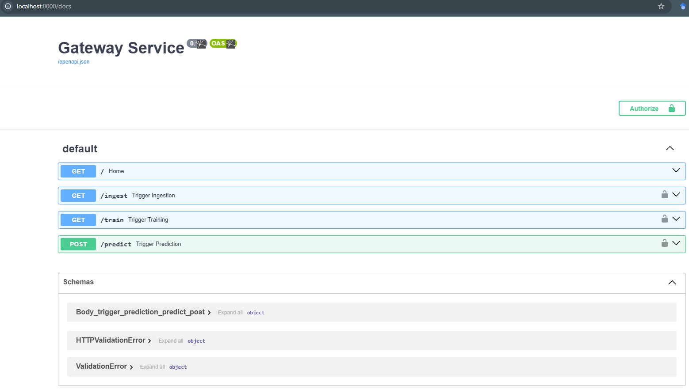
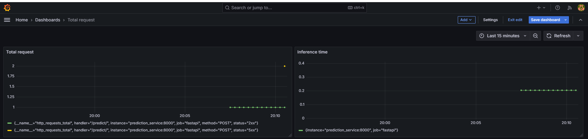

# Handwritten Text Recognition Using Deep Learning (OCR MLOps Project)

> **Note:** This is a general overview of the project. For technical details and commands to reproduce the work, please refer to the [Technical Guide](TECHNICAL_GUIDE.md).

## Introduction

Handwritten text recognition (HTR) is a crucial step in document digitization, allowing computers to extract and process handwritten text from images. This project aims to develop an end-to-end **Optical Character Recognition (OCR)** system for handwritten documents, leveraging **deep learning techniques** and **MLOps principles** to ensure efficient model deployment and maintenance.

Traditional OCR engines, such as PyTesseract and EasyOCR, perform well on printed text but struggle with handwriting due to variations in styles, spacing, and distortions. To address these challenges, we designed a **custom deep learning model** based on **Convolutional Neural Networks (CNNs)**.

This project is designed to integrate **automated pipelines** for:
- **Data preprocessing**
- **Model training and evaluation**
- **Monitoring and logging**
- **Deployment and inference**

The solution is intended for industries such as **insurance, healthcare, and administrative services**, where the digitization of handwritten documents is essential for efficiency and cost reduction.

## Project Organization

    OCR_Handwriting_MLOps
    ├── src/                               <- Source code for the OCR pipeline
    │   │
    │   ├── data/                          <- Scripts for the ingestion stage, including loading data and preprocessing
    │   │   ├── extract_raw_data.py        <- Extracts the raw data from the compressed dataset
    │   │   ├── load_dataset.py            <- Loads the dataset into memory
    │   │   ├── filter_data.py             <- Filters out unwanted or corrupted data samples
    │   │   ├── clean_data.py              <- Cleans and preprocesses raw text/image data
    │   │   ├── encode_data.py             <- Encodes categorical or textual data into numerical format
    │   │   ├── prepare_features.py        <- Prepares feature vectors for model training
    │   │   ├── split_data.py              <- Splits the dataset into training and test sets
    │   │   ├── reshape_data.py            <- Reshapes data to fit the input requirements of the deep learning model
    │   │   ├── calculate_class_weights.py <- Computes class weights to handle class imbalance in training
    │   │   ├── one_hot_encode_labels.py   <- Applies one-hot encoding to categorical labels
    │   │   ├── ingestion.py               <- FastAPI app exposing an '/ingest' endpoint to trigger the DVC pipeline stage for data ingestion.
    │   │   ├── Dockerfile-ingestion       <- Dockerfile for the data ingestion pipeline
    │   │   └── requirements.txt           <- Dependencies required for running the ingestion service
    │   │
    │   ├── models/                        <- Scripts for the training stage
    │   │   ├── setup_callbacks.py         <- Defines training callbacks
    │   │   ├── build_train_cnn.py         <- Builds and trains the CNN model
    │   │   ├── evaluate_model.py          <- Evaluates model performance
    │   │   ├── training.py                <- FastAPI app exposing a '/train' endpoint to trigger the training pipeline via DVC.
    │   │   ├── Dockerfile-training        <- Dockerfile for model training and inference pipeline
    │   │   └── requirements.txt           <- Dependencies required for running the training service
    │   │
    │   ├── api/                           <- Scripts for prediction microservice and FastAPI endpoints
    │   │   ├── prediction.py              <- Loads OCR model and define API '/predict' endpoints for prediction
    │   │   ├── gateway.py                 <- Implements authentication, role-based access control, and request distribution for prediction, training, and ingestion services
    │   │   ├── Dockerfile-prediction      <- Dockerfile for the prediction microservice
    │   │   ├── Dockerfile-gateway         <- Dockerfile for the Gateway service
    │   └   └── requirements.txt           <- Dependencies required for running the prediction service
    │
    ├── data/                              <- Directory for storing raw and processed data
    │
    │   ├── processed/                     <- Processed data
    │   │   └── .gitignore                 <- Files to be excluded from Git version control dataset
    │   │
    │   ├── raw/                           <- Raw data
    │   │   ├── .gitignore                 <- Files to be excluded from Git version control dataset
    │   │   ├── raw_data/data/raw/         <- Extracted data
    │   │   │   ├── words/                 <- Extracted images
    │   └   └── ascii/                     <- Extracted metadata
    │
    ├── models/                            <- Saved trained models
    │
    ├── prometheus_data/                   <- Stores Prometheus configuration and monitoring data
    │   ├── alerting_rules                 <- Defines alerting rules for triggering notifications
    │   └── prometheus.yml                 <- Prometheus configuration file
    │
    ├── grafana_data/                      <- Stores Grafana-related configuration and data
    │   ├── provisioning/
    │   │   ├── dashboards/
    │   │   │   └── dashboards.yaml        <- Specifies available dashboards configuration
    │   │   ├── datasources/
    │   └   └   └── datasource.yml         <- Specifies data source configuration
    │
    ├── alertmanager/                      <- Configures alerting rules for system failures
    │
    ├── tests/                             <- Contains unit test scripts
    │   ├── test_data/                     <- Unit test scripts for the data ingestion service
    │   ├── test_models/                   <- Unit test scripts for the model training service
    │   └── Dockerfile-tests               <- Dockerfile for the test service
    │
    ├── docs/                              <- Documentation for the project
    │
    ├── logs/                              <- Storing application runtime logs
    │
    ├── .dvc/                              <- stores stores metadata for DVC-tracked files, cache, and configurations
    │
    ├── .github/                           <- Files and folders to be excluded from Git version control
    │   ├── workflow/                      <- Unit test scripts for the data ingestion service
    │   └   └── test.yml                   <- CI workflow to install dependencies, pull DVC data, check files, and run tests
    │
    ├── .gitignore                         <- Files and folders to be excluded from Git version control
    ├── .dvcignore                         <- Files and folders to be excluded from DVC tracking
    ├── .dockerignore                      <- Files and folders to be excluded from Docker builds
    ├── docker-compose.yml                 <- Runs containerized services (API, database, monitoring)
    ├── dvc.lock                           <- DVC metadata tracking file
    ├── dvc.yaml                           <- Defines DVC pipeline stages 
    ├── run_mlops_pipeline.ah              <- Automates the pipeline in Linux (prompt command)
    ├── run_mlops_pipeline.ps1             <- Automates the pipeline in Windows (PowerShell)
    ├── requirements.txt                   <- Dependencies required for running the project
    ├── TECHNICAL_GUIDE.md                 <- Detailed technical guide
    └── README.md                          <- Project overview

## Architecture Diagram

The diagram below illustrates the overall architecture of the project. It consists of multiple Docker services orchestrated together, including ingestion, training, and prediction, all managed under GitHub Actions and DagsHub.  

- **Gateway**: Manages authentication and authorization for all requests.  
- **Ingestion Service**: Handles data collection and preprocessing.  
- **Training Service**: Trains machine learning models using the ingested data.  
- **Prediction Service**: Provides model inference for users.  
- **MLflow**: Tracks experiments and model versions.  
- **Monitoring**: Automate system health checks.
- **Cron Jobs**: Automate retraining and system health checks. 
- **CI Unit Tests**: Ensure code quality and reliability through automated testing.
- **GitHub Actions**: Automates testing, building, and deployment workflows.  
- **Docker Hub**: Stores and distributes Docker images for the services.   

 
> - For GitHub Actions, please refer to: [GitHub Actions](https://github.com/claudiawis/OCR_Handwritting_MLOps/actions)  
> - For Docker Hub, check: [Docker Hub Repository](https://hub.docker.com/repository/docker/claudiawis/ocr_handwritting_mlops/general)

## API Endpoints:

The **Gateway Service** acts as a central API that routes requests to the **Ingestion**, **Training**, and **Prediction** services. It ensures that only authorized users can access specific endpoints.

To access the Gateway, open your browser and go to: **[http://localhost:8000](http://localhost:8000)**  

The table below summarizes the access control for each service:

| Service   | Access Level |  Username | Password |
|-----------|-------------|----------|----------|
| **Prediction** | All Users   |  `user1`  | `1resu`  |
| **Ingestion** | Admins Only  |  `admin1`  | `1nimda`  |
| **Training**  | Admins Only  |  `admin1`  | `1nimda`  |

## Grafana for Monitor

The project includes **Grafana** for real-time monitoring and visualization of system metrics. Grafana is configured to track the performance of the ingestion, training, and prediction services, as well as resource usage (CPU, memory, and network activity).

Below is a screenshot of the Grafana dashboard:

To access Grafana, open your browser and go to:**[http://localhost:3000](http://localhost:3000)**

**Default Credentials:**
- **Username:** `admin`
- **Password:** `admin` (Change this after first login!)

## Service Ports Summary

| Service       | Container Name       | Port (Host:Container) |
|--------------|----------------------|-----------------------|
| Gateway      | gateway_service       | 8000:8000            |
| Ingestion    | ingestion_service     | 8100:8100            |
| Training     | training_service      | 8200:8200            |
| Prediction   | prediction_service    | 8300:8300            |
| Prometheus   | prometheus_service    | 9090:9090            |
| Grafana      | grafana_service       | 3000:3000            |

> **Note:** These ports are based on `docker-compose.yml`.
